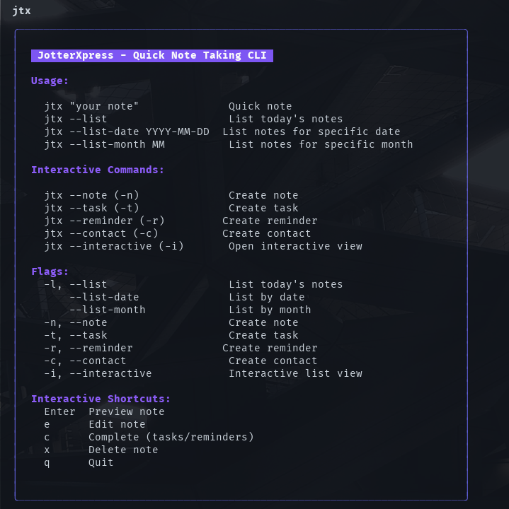

# 📝 JotterXpress

A fast and simple CLI tool for taking notes, managing tasks, contacts, and reminders.



## Description

JotterXpress is a command-line application that allows you to create and manage notes quickly and efficiently. It supports multiple note types (text, tasks, contacts, and reminders) with an interactive and colorful interface.

## Commands

### Create notes
```bash
# Quick text note
jtx "Your note here"

# Interactive mode for long notes
jtx -n
```

### Manage tasks
```bash
# Create a task (interactive)
jtx -t

# Create a reminder (interactive)
jtx -r
```

### Manage contacts
```bash
# Create a contact (interactive)
jtx -c
```

### List and search
```bash
# View today's notes
jtx -l

# View notes for a specific date
jtx --list-date "2025-01-25"

# View notes for a month
jtx --list-month "01"
```

### Interactive view
```bash
# Open interactive list of all notes
jtx -i
```

### Help
```bash
# Show general help
jtx
```
